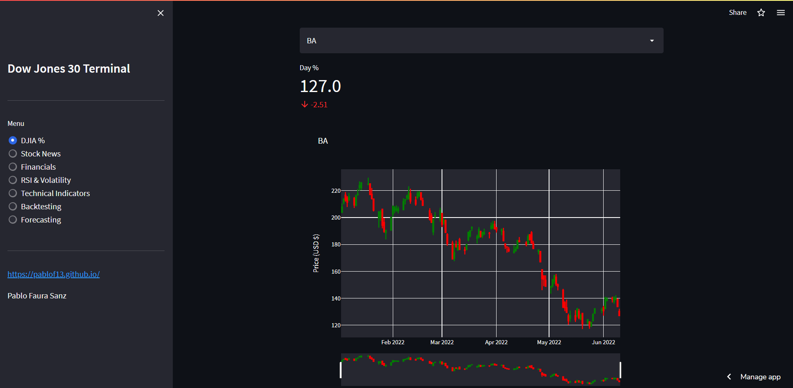
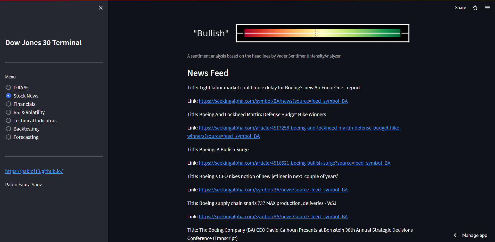
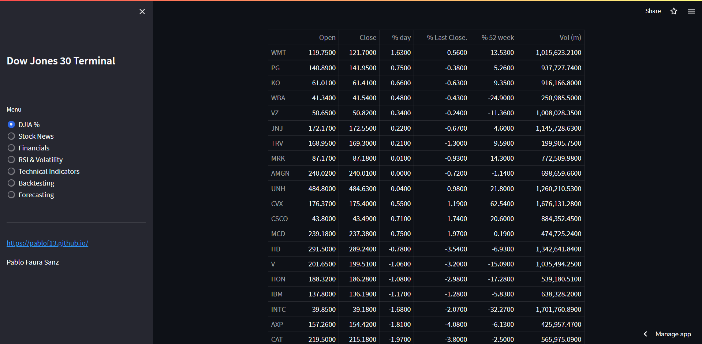
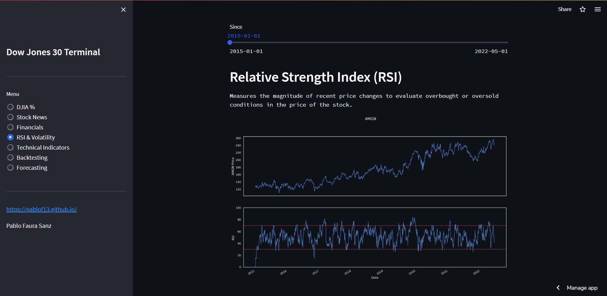
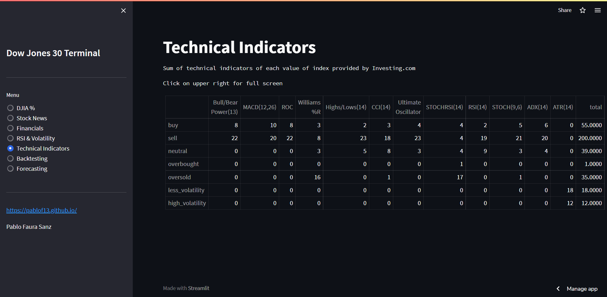
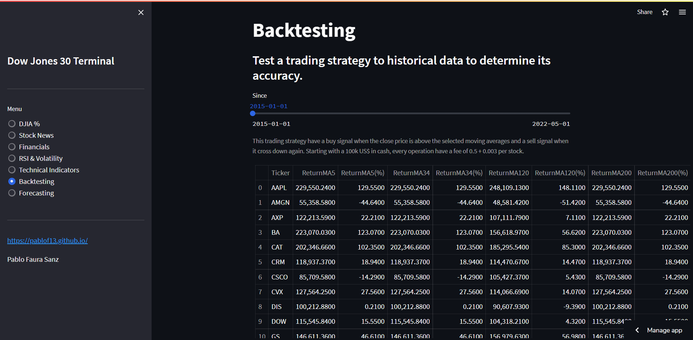

# Dow Jones 30 Terminal

Vamos a utilizar el framework de visualización de Streamlit para simular una terminal de datos financieros en la que podamos consultar datos como rentabilidad, noticias, análisis de sentimiento, predicción etc. de los 30 valores del Dow Jones Index

*Rentabilidad diaria y anual*

*Noticias y análisis de sentimiento de estas*

*Rentabilidad diaria y anual en orden descendente diario*

*Indicador RSI*

*Suma de indicadores técnicos*

*Backtesting de estrategias de trading*
